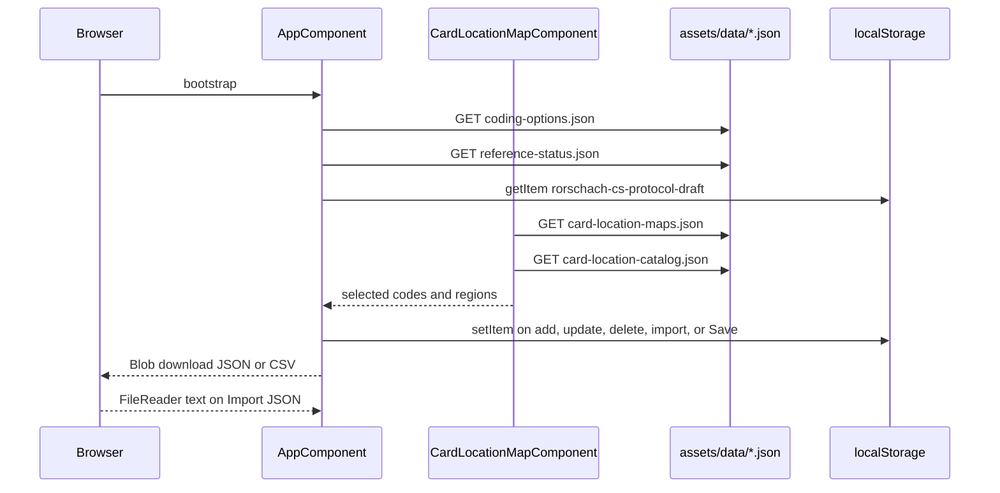
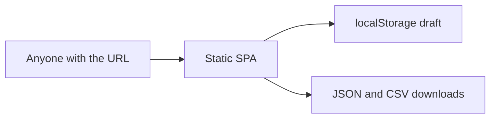
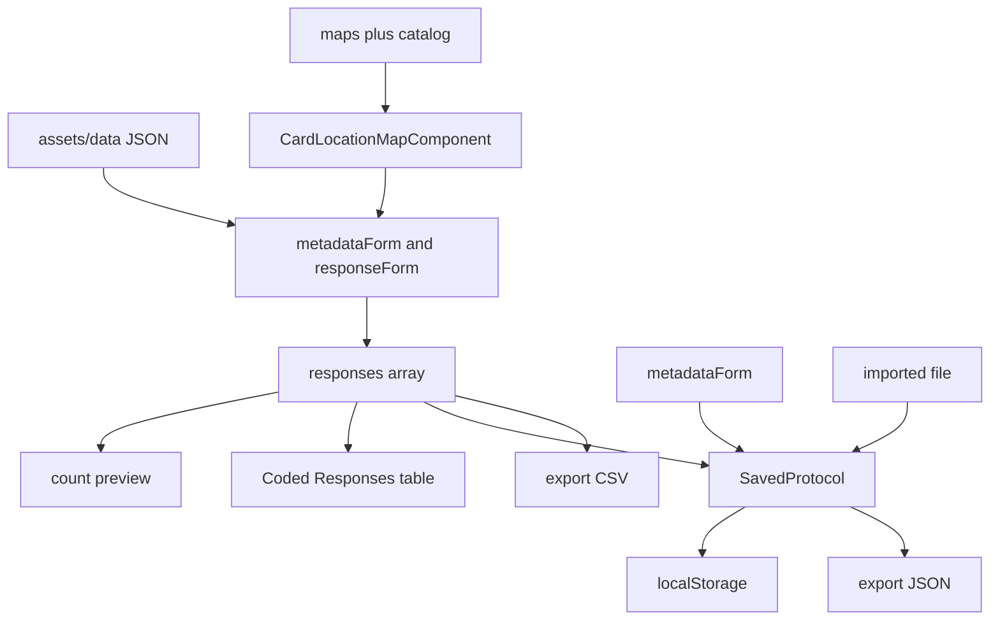

# Architecture

Last updated: 2026-09-24

This file describes the implementation in the repository. Older root notes (`ARCHITECTURE.md`, `DEVELOPMENT_STATUS.md`, `KNOWN_ISSUES.md`) predate all-ten-card maps, committed blot images, `.gitignore`, and GitHub Pages. When they disagree with the code, follow the code and this `docs/` set.

## Architecture pattern

**Client-only single-page workstation.** One standalone root component owns protocol state. One child component owns the location map. Two injectable services own persistence and file exchange. Catalogs are static JSON fetched with `HttpClient`. There is no router, no NgModule, no app-wide store, no backend, and no database.

```
bootstrapApplication(AppComponent)
        │
        ▼
AppComponent.ngOnInit()
  ├── GET assets/data/coding-options.json
  ├── GET assets/data/reference-status.json
  └── localStorage restore (silent) → metadataForm + responses[]
        │
        ▼
User edits metadata + response form
  └── CardLocationMapComponent
        GET card-location-maps.json + card-location-catalog.json
        emit codes + region objects
        AppComponent auto-fills Location / Location Number
        │
        ▼
Add / Update / Delete → responses[] → localStorage
        │
        ├── Structural Summary Preview (counts)
        ├── Coded Responses table
        ├── Export JSON / CSV (Blob download)
        └── Import JSON (FileReader → applyProtocol → save)
```

## Frontend architecture

| Layer | Choice |
| --- | --- |
| Framework | Angular 19 standalone components |
| Bootstrap | `bootstrapApplication` in `src/main.ts` |
| UI | Angular Material 19 prebuilt theme `azure-blue` |
| Forms | Reactive Forms, `UntypedFormBuilder` |
| HTTP | `HttpClient` for bundled JSON only |
| State | Fields on `AppComponent` |
| Styling | Global `src/styles.scss` + colocated component SCSS |
| Language | TypeScript 5.7, `strict` and `strictTemplates` |
| Build | `@angular-devkit/build-angular:application` (Vite) |
| Tests | None. `angular.json` has no `test` target and no lint target |

`@angular/router` is a dependency and is unused.

### State owned by `AppComponent`

| Field | Role |
| --- | --- |
| `metadataForm` | Protocol header |
| `responseForm` | Response being entered or edited |
| `responses` | Coded list |
| `editingId` | When set, Add becomes Update and keeps the response `id` |
| `options` | Coding catalogs |
| `referenceStatus` | Loaded, not rendered |
| `locationTypeWarning` | Mixed-region message |

`editingId` uses `crypto.randomUUID()` for new rows.

### Child component

`CardLocationMapComponent` (`app-card-location-map`) is the only child. Inputs: `cardNumber`, `selectedLocationCodes`. Outputs: `locationSelectionChange`, `selectedRegionsChange`, `regionClicked`.

`W` is exclusive on the map: selecting Whole Blot clears other codes; selecting a detail clears `W`.

### Services

| Service | Responsibility |
| --- | --- |
| `LocalStorageService` | `save` / `load` / `clear` for one `SavedProtocol` |
| `ExportService` | JSON download, JSON parse check, CSV download |

Both are `providedIn: 'root'` and injected with `inject()`.

### Domain types

`src/app/models/rorschach.models.ts` is the only model module. Persistence DTO is `SavedProtocol`:

```json
{
  "metadata": {
    "examineeCode": "",
    "age": null,
    "gender": "",
    "date": "",
    "examiner": "",
    "notes": ""
  },
  "responses": [
    {
      "id": "",
      "cardNumber": "",
      "responseNumber": null,
      "verbatimResponse": "",
      "inquiry": "",
      "locationPointed": "",
      "madeItLookLike": "",
      "examinerNotes": "",
      "imageLocations": [],
      "location": "",
      "locationNumber": "",
      "developmentalQuality": "",
      "determinants": [],
      "formQuality": "",
      "formQualityExplanation": "",
      "contentCodes": [],
      "popular": false,
      "specialScores": [],
      "codingExplanation": "",
      "confidence": "Medium",
      "missingInformation": "",
      "selectedLocationCodes": [],
      "selectedLocationRegions": []
    }
  ]
}
```

`imageLocations` remains on the model. The click-to-mark methods on `AppComponent` have no template bindings.

## Backend architecture

There is no backend. The app is a static SPA. `HttpClient` reads files that the Angular build copies from `src/assets` to `assets/`. There are no servers, workers, cloud functions, or remote APIs.

GitHub Actions (`.github/workflows/deploy-pages.yml`) builds that static bundle and publishes it to GitHub Pages. The workflow is a deploy pipeline, not an application backend.

## Database architecture

There is no database, schema, or migration runner. The persistence contract is the JSON document above.

| Store | Key | Scope |
| --- | --- | --- |
| `localStorage` | `rorschach-cs-protocol-draft` | One draft per browser origin |

`load()` returns `null` on a missing key or invalid JSON. It does not validate field types. Import uses the same shallow check as `ExportService.parseJson` (`metadata` present and `responses` is an array).

## API flow

There is no application API. The only HTTP calls are GET requests for static assets:



| Call | Consumer | Failure behavior |
| --- | --- | --- |
| `assets/data/coding-options.json` | `AppComponent.loadConfig` | Snackbar: coding options could not be loaded |
| `assets/data/reference-status.json` | `AppComponent.loadConfig` | Silent; defaults stay in memory |
| `assets/data/card-location-maps.json` | Map `forkJoin` | `loadFailed`; placeholder copy |
| `assets/data/card-location-catalog.json` | Map `forkJoin` | Same `forkJoin` error path |
| Card PNG | `` | `imageMissing`; SVG overlay still shows when polygons exist |

## Authentication flow

There is no authentication or authorization. Anyone who can open the origin can read and write the local draft and download exports. There is no user identity, role, session, encryption, or audit log.



Treat protocol JSON as sensitive clinical data. The browser profile is not a vault.

## Data flow



Location auto-fill runs in the parent after `selectedRegionsChange`. Location Number is overwritten from the selected codes (`W`, or a comma-joined list) on every map emission, including a clear.

## Folder structure

```
rorsach/
├── docs/                                 # this documentation set
├── src/
│   ├── main.ts                           # bootstrapApplication, animations, HttpClient
│   ├── index.html                        # Inter + Material Icons, inline SVG favicon
│   ├── styles.scss                       # global background, type, box-sizing
│   ├── app/
│   │   ├── app.component.ts/html/scss    # workstation UI and orchestration
│   │   ├── models/rorschach.models.ts    # domain types
│   │   ├── services/
│   │   │   ├── local-storage.service.ts
│   │   │   └── export.service.ts
│   │   └── components/card-location-map/ # SVG overlay + code palette
│   └── assets/
│       ├── cards/                        # card-i.png … card-x.png (tracked)
│       └── data/
│           ├── coding-options.json
│           ├── reference-status.json
│           ├── card-location-maps.json   # polygons for cards I–X
│           └── card-location-catalog.json
├── books/                                # authoring starters + generate-starter-maps.mjs
├── .github/workflows/deploy-pages.yml    # GitHub Pages on push to main
├── angular.json                          # prefix app, SCSS, pages baseHref /rorsach/
├── package.json                          # version 0.1.0
└── tsconfig.json                         # strict + strictTemplates
```

Also present and gitignored or local: `node_modules/`, `dist/`, `.angular/`, `exports/`, `books/appendix-a-*.png`, `books/*.pdf`, `pdf2png/`.

There is no `src/app/app.config.ts`, no routes, and no feature libraries.

### `books/`

Authoring copies of starter maps and `generate-starter-maps.mjs`, which builds Cards II, III, and V–X from normalized image fractions (`x = 147 + fx * 706`, `y = fy * 1000`) for a 723×1024 photo inside a 1000×1000 viewBox with `object-fit: contain`. The runtime app reads `src/assets/data/card-location-maps.json`, not the files in `books/`.

## Coding standards in use

- Standalone components, `inject()`, Angular control flow (`@if`, `@for`).
- `app` selector prefix. Colocated SCSS. Domain types in one models file. Catalogs in `src/assets/data/`.
- Material form fields use `appearance="outline"`. Feedback uses `MatSnackBar`.
- New response ids come from `crypto.randomUUID()`.
- CSV cells are quoted and internal quotes are doubled.
- Subscriptions on the root component are not torn down. The component lives for the whole session.
- Forms are untyped (`UntypedFormBuilder`) and `buildResponseFromForm` casts with `as RorschachResponse`.

## External integrations

| Integration | Role |
| --- | --- |
| Google Fonts (Inter, Material Icons) | Runtime stylesheets in `index.html` |
| GitHub Pages | Static hosting of the production bundle |
| Official Exner tables | Not integrated |
| Auth, analytics, crash reporting | None. `angular.json` contains an Angular CLI analytics id only |
